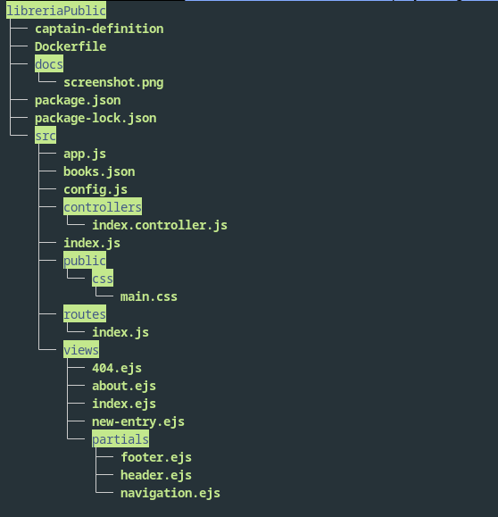

<!DOCTYPE html>
<html lang="en">
<body>
    <h1>listado de proyectos echos en el año 2024</h1>
    <ul>
        <li>libreria publica </li>
        <li>proyectos java</li>
        <ul>
            <li>calculadora</li>
            <li>sistema admin</li>
            <li>sistema cliente</li>
            <li>... practicas</li>
        </ul>
        <li>sumo basico</li>
        <li>curso ia javaScript con microsoft</li>
    </ul>
     
    

    <h2>libreria publica</h2>
    
    
este proyecto fue echo con la intencio de ver como funciona el guardado de datos en un archivo json como una base de datos

</body>
</html>