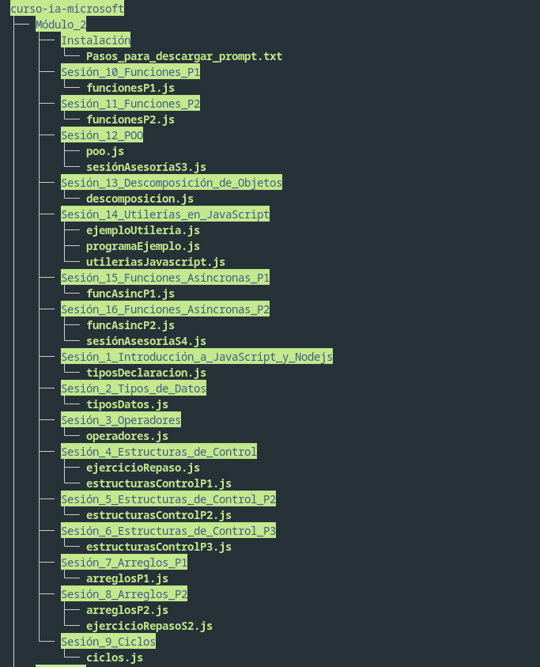
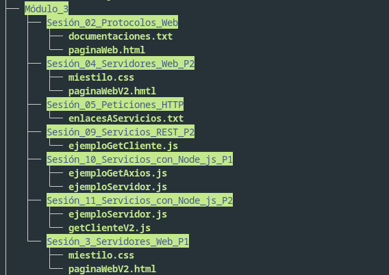
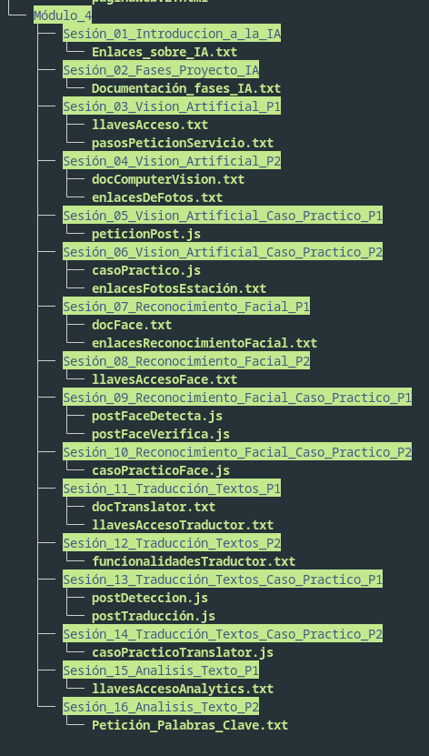
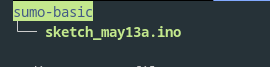
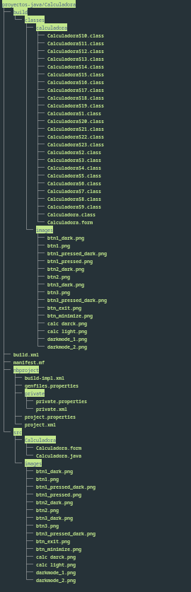
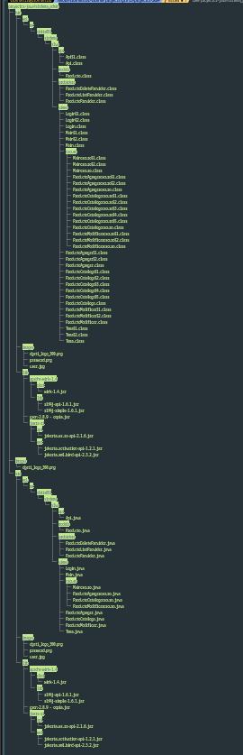

<!DOCTYPE html>
<html lang="en">
<body>
    <h1>listado de proyectos echos en el año 2024</h1>
    <ul>
        <li>libreria publica </li>
        <li>proyectos java</li>
        <ul>
            <li>calculadora</li>
            <li>sistema admin</li>
            <li>sistema cliente</li>
            <li>... practicas</li>
        </ul>
        <li>sumo basico</li>
        <li>curso ia javaScript con microsoft</li>
    </ul>
     
    

    <h2>libreria publica</h2>
    
    
este proyecto fue echo con la intencio de ver como funciona el guardado de datos en un archivo json como una base de datos

     
    

    <h2>curso ia javaScript con microsoft</h2>
    
este modulo mas que proyecto es una serie de practicas y conceptos de javaScript para el desarrollo de la implementacion de modelos de la ia para el desarrollo de aplicaciones web con javaScript   estructura del proyecto:  

      
      
    
     

    <h2>sumo basico</h2>
    
proyecto que permite el desarrollo y reforzamiebnto de los conceptos en electronica y arduino al igual  que en la programacion de este

    
     

    <h2>proyectos java</h2>
    
proyectos desarrollados con java

    <ul>
        <li>calculadora</li>
        <li>sistema admin</li>
        <li>sistema cliente</li>
        <li>... practicas</li>
    </ul>
    
fueron proyectos desarrollados en java que permitieron el reforzar conceptos tales como interfaces graficas,consumo de api rest, manejo de usuarios por roles etc.

    
         
    
</body>
</html>